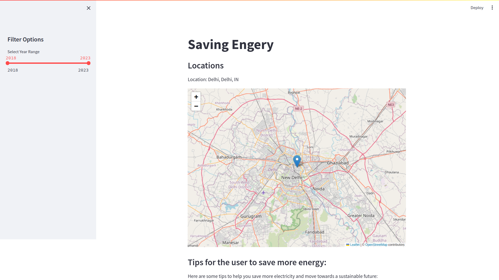
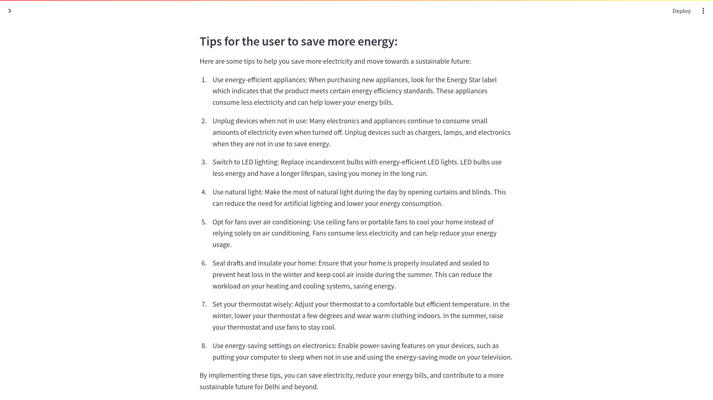
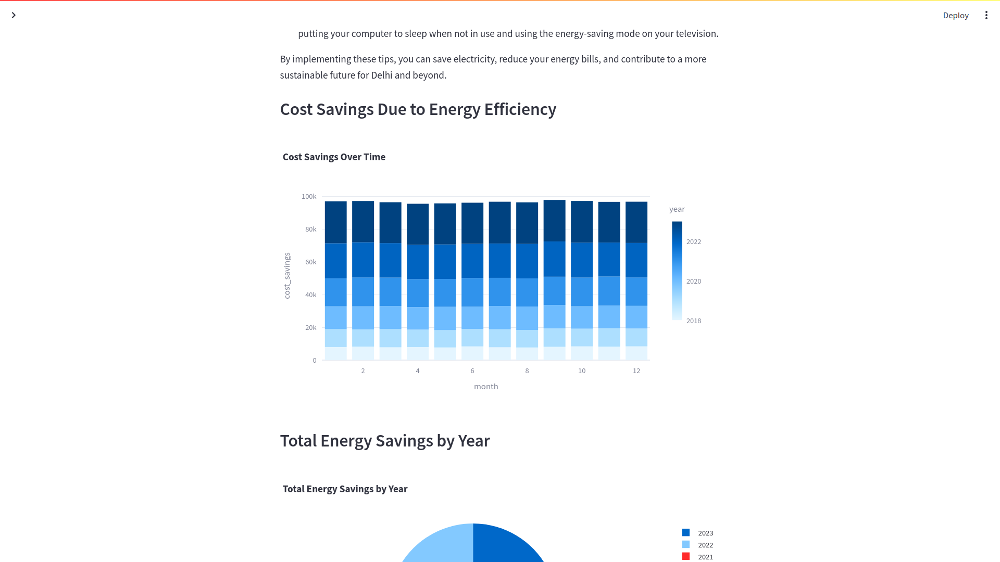
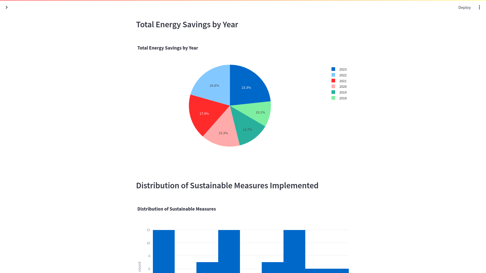
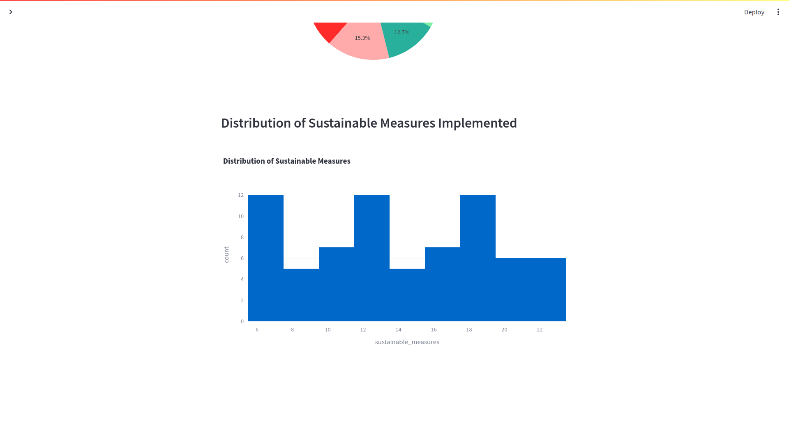

# Energy Optimisation

This project aims to show case the importance of the .

## Images

<table>
  <tr>
    <td>
      
    </td>
    <td>
      
    </td>
  </tr>
</table>

<table>
  <tr>
    <td>
      
    </td>
    <td>
      
    </td>
    <td>
      
    </td>
  </tr>
</table>

## Features

- Visualisation of energy consumption data
- Interactive map showing user's location
- Filter options for specific year ranges

## Installation

This project uses Poetry for dependency management. To set up the project:

1. Clone the repository
2. Install Poetry: `pip install poetry`
3. Install dependencies: `poetry install`

## Usage

To run the application:

```sh
streamlit run main.py
```

## Contributing
Contributions are welcome! Please read the contributing guidelines [first](./CONTRIBUTION.md).

## License
This project is licensed under the terms of the MIT license. See LICENSE for more details.